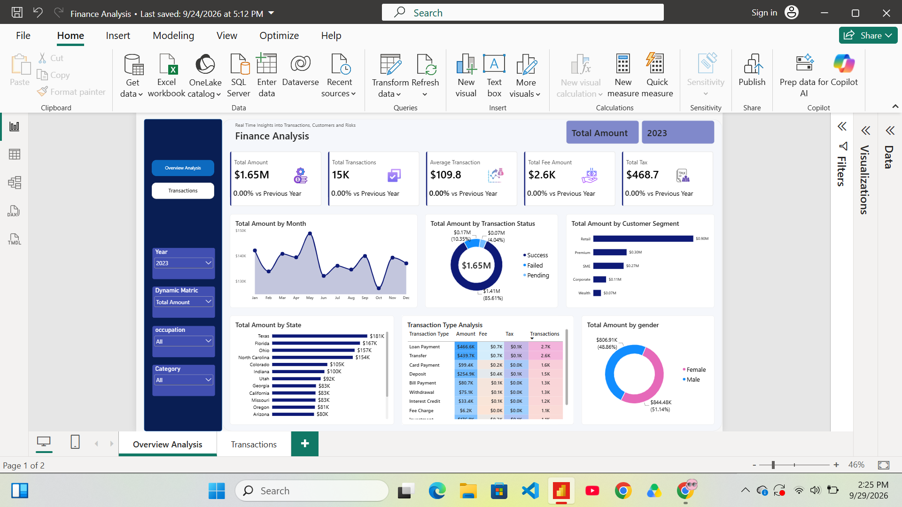
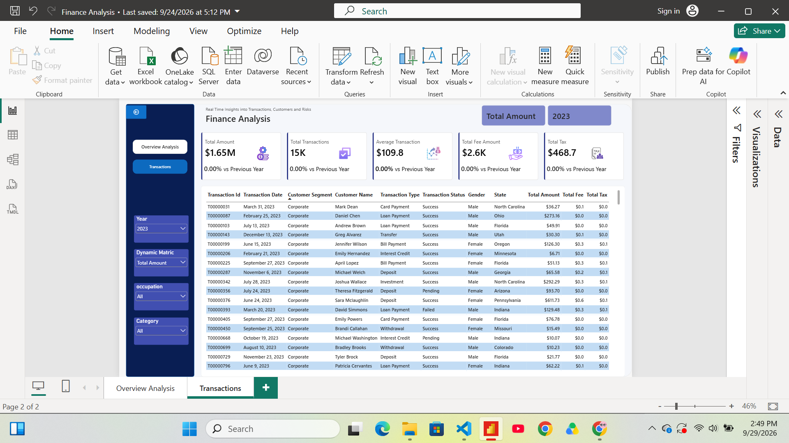

<div align="center">

# 💳 Finance Analysis Dashboard

**Transactions, customers and risk in one interactive Power BI report**





</div>

---

## 📑 Contents

[Overview](#-overview) · [Dashboard at a Glance](#-dashboard-at-a-glance) · [Key Findings](#-key-findings) · [Year-over-Year](#-year-over-year-comparison) · [Data](#-the-data) · [Data Model & DAX](#-data-model--dax) · [How to Explore](#-how-to-explore) · [Run It Locally](#-run-it-locally) · [Next Steps](#-next-steps) · [About Me](#-about-me)

---

## 🎯 Overview

This project analyzes **50K+ banking transactions** from **January 2023 to April 2026**. I built it to answer the questions a finance team asks every week:

- How much money is moving, and is it steady month to month?
- What share of transactions succeed, fail, or stay pending?
- Which customer segments, states and transaction types drive the most value?
- How much do fees and taxes add up to?

The source data was India-specific, so I localized it for a US context (US states and cities, USD, and channels like Zelle).

---

## 🖥️ Dashboard at a Glance

**Overview Analysis** is the main page:

| Visual | What it shows |
|--------|---------------|
| KPI cards | Total Amount, Transactions, Average Transaction, Fees and Tax, each compared with the previous year |
| Total Amount by Month | The monthly trend |
| Transaction Status | Success, Failed and Pending split |
| Customer Segment | Retail, Premium, SME, Corporate and Wealth |
| Total Amount by State | Ranked bars across 16 states |
| Transaction Type Analysis | Heat-mapped table of amount, fee, tax and count per type |
| Gender Split | Female vs Male share of volume |

**Transactions** is the detail page. It keeps the same KPI cards and slicers, and adds a transaction-level table with the transaction ID, date, customer name and segment, transaction type, status, gender, state, and the amount, fee and tax for each row. From the Overview page you can drill through to it, so a bar, slice or segment you click on becomes a list of the actual transactions behind it. A back button at the top left returns you to the Overview.


**Interactivity:** slicers for **Year**, **Occupation** and **Category**, a **Dynamic Metric** selector that swaps the measure across the visuals, page navigation buttons, and full cross-filtering between visuals.

---

## 🔍 Key Findings

Figures below are for **2023**. The year-over-year section shows how the other years compare.

| KPI | Value |
|-----|-------|
| Total Amount | **$1.65M** |
| Transactions | **15K** |
| Average Transaction | **$109.8** |
| Total Fees | **$2.6K** |
| Total Tax | **$468.7** |

- **About 86% of the money moves successfully.** Roughly 10% fails and 4% stays pending, which is around $237K that didn't land. This is the first place I would look for risk.
- **Retail carries the business.** It accounts for about 54% of volume ($0.90M), well ahead of Premium (18%) and SME (16%). Wealth is the smallest at about 4%.
- **Loan payments and transfers dominate.** Together they make up about 55% of volume and also generate the most fees.
- **Texas, Florida, Ohio and North Carolina lead by state**, each above $150K. Washington sits at the bottom.
- **Gender split is close to even:** women about 51% ($844K), men about 49% ($807K).
- **Monthly volume is steadier than the chart suggests.** The chart axis starts at $130K, which exaggerates the swings. Every month actually falls between roughly $127K and $149K.

---

## 📆 Year-over-Year Comparison

The business is very consistent across years: about **$1.65M per full year**, **15K transactions** and an average ticket near **$110**.

| Year | Total Amount | Transactions | Avg Transaction | Success Rate | Fraud Rate |
|------|-------------|--------------|-----------------|--------------|-----------|
| 2023 | $1.651M | 15,034 | $109.8 | 85.6% | 1.22% |
| 2024 | $1.633M | 15,030 | $108.7 | 85.0% | 1.24% |
| 2025 | $1.656M | 14,944 | $110.8 | 85.4% | 1.30% |
| 2026 *(Jan–Apr)* | $0.546M | 4,993 | $109.4 | 85.9% | 1.28% |

> **Note on 2026:** the data ends in April, so 2026 is a partial year. Compared with the same four months of 2025, volume is essentially flat (about -1%).

**What shifted, slightly**
- Women's share of volume rose from 51.1% (2023) to 52.8% (2025).
- Wealth customers grew from 4.2% to 5.2% of volume by 2026.
- Ohio climbed to 10.5% of volume in 2026, up from about 9.5%.

**What stayed the same**
- Retail holds roughly 54% of volume every year.
- Texas and Florida lead the state ranking every year.
- Loan Payments and Transfers remain the top two transaction types.

> The KPI cards show 0.00% vs Previous Year for 2023 because the data has no earlier year to compare against. Select 2024 or later to see the real changes.

---

## 🗂️ The Data

Two CSV files of synthetic banking data:

| File | Rows | Contents |
|------|------|----------|
| `customers_us.csv` | 5,000 | Customer ID, name, gender, date of birth, city, state, occupation, segment, annual income, join date |
| `finance_transactions_us.csv` | ~50,000 | Transaction ID and date, account, customer, type, channel, merchant category, amount, fee, tax, status, fraud flag, risk score |

**Coverage:** 16 states, 20 cities, 5 segments, 6 occupations, 10 transaction types, 7 channels, 14 merchant categories.

**Data quality checks (Power Query):**
- Set proper date types for transaction, birth and join dates
- Cleaned and renamed columns 
- 24 blank fee amounts and a few blank risk scores 
- About 69 repeated transaction IDs in the raw file 

---

## 🧮 Data Model & DAX

**Model:** star schema. `Transactions` is the fact table and connects to `Customers` on `customer_id` (many-to-one), which lets state, gender, segment and occupation filter every transaction visual.

**Core measures** 

```DAX
Total Amount        = SUM(Transactions[amount])
Total Transactions  = COUNTROWS(Transactions)
Average Transaction = DIVIDE([Total Amount], [Total Transactions])
Total Fee Amount    = SUM(Transactions[fee_amount])
Total Tax           = SUM(Transactions[tax_amount])

Amount PY = CALCULATE([Total Amount], SAMEPERIODLASTYEAR('Date'[Date]))
YoY %     = DIVIDE([Total Amount] - [Amount PY], [Amount PY])
```

---

## 🧭 How to Explore

Try these to see the slicers in action:

- Set **Year = 2025** and **Dynamic Metric = Total Tax** to see where tax is concentrated.
- Filter **Occupation = Student** and watch how the state ranking changes.
- Click a segment bar to see which states and transaction types it drives.
- Click **Failed** in the status donut, then drill through to the Transactions page to see the individual failed payments.

---

## 🚀 Run It Locally

1. Clone the repo
   ```bash
   git clone https://github.com/<your-username>/finance-analysis-powerbi-dashboard.git
   ```
2. Open `Finance Analysis.pbix` in **Power BI Desktop**.
3. If prompted, point the data source to the `data/` folder under **Transform data → Data source settings**.

```
finance-analysis-powerbi-dashboard/
├── Finance Analysis.pbix
├── data/
│   ├── customers_us.csv
│   └── finance_transactions_us.csv
├── images/
│   ├── overview-analysis.png
│   └── transactions.png
└── README.md
```

---

## 🔮 Next Steps

- **Fraud and risk page** using the existing `is_fraud` flag (about 1.3% of transactions) and `risk_score`
- **Channel and merchant category analysis** for the 7 channels and 14 categories not yet visualized
- **Customer profile page** with each customer's full history and risk score
- **Publish to Power BI Service** with scheduled refresh

---

## 👤 About Me

**Wajeeha Noor** · Data Analyst
[Email](wajeeham78@gmail.com.com)

⭐ If this project was useful or interesting, a star on the repo is appreciated.
